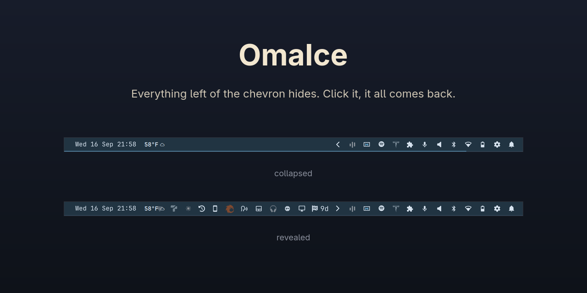

# OmaIce

A chevron for the Omarchy bar that hides everything to its left in its own
section, bar widgets and tray icons alike. Click it when you want them back.

Omarchy already ships a chevron, but it belongs to the system tray and only ever
hides tray icons. Bar widgets have nowhere to go: WhatsApp, Spotify, a VPN
indicator, the half-dozen things that accumulate on the right. OmaIce replaces
that chevron with one that treats the whole section as fair game.



## Requirements

OmaIce requires Omarchy 4.0.3 or later. The plugin is QML loaded into the shell
you are already running, so it installs from git and runs in process.

Earlier releases are no longer supported. The current code finds its bar slot by
walking the QML scene, which works on 4.0.2 as well, but only 4.0.3 is tested.

## Install

```bash
omarchy plugin add https://github.com/TerrifiedBug/omaice --enable --yes
omarchy plugin disable omarchy.tray
```

Both commands matter. OmaIce draws the system tray itself, so the built-in tray
widget has to step aside; leave it enabled and you get two chevrons and every
tray icon twice. Order matters too, pleasantly: `--enable` drops OmaIce directly
after the tray, so the only thing behind your new chevron is the old tray
widget. The second command tidies away the leftover.

If you install with the tray already disabled, OmaIce lands at the end of the
section instead, which means everything in it starts out hidden. Nothing is
lost; click the chevron to see it all, then park it where you want the boundary:

```bash
omarchy bar move io.github.terrifiedbug.omaice --section right --index <n>
```

Everything left of the chevron in that section is the hidden set, so `<n>` is
how many widgets you want it to swallow.

## Using it

Click the chevron to reveal the hidden section, click again to collapse it. It
also collapses on its own ten seconds after your pointer leaves it. Set
`rehideSeconds` to `0` if you would rather it stayed put.

To hide a widget, put it to the left of the chevron. That is the entire rule.
Drag it there with Omarchy's own bar drag-reorder, or right click the chevron
and use the "Bar widgets" list.

The list is built for changing your mind: it stays open however many rows you
toggle, and the bar shows you the result as you go, so you can shuffle five
widgets and watch the section shrink before anything is saved. The moves are
written to your layout when you close the menu, one `omarchy bar move` per
widget you changed, so the bar does blink once per change as it re-lays out.
Nothing is written while the menu is open.

Widget names in that list come from the widget's id, so a plugin shows up as
`Omaproton vpn` rather than the name its author picked. The host does not hand
plugins its widget registry.

Right click also pins and hides individual tray icons. A pinned icon stays in
the bar even while the section is collapsed; a hidden one never appears at all.
Everything else lives behind the chevron.

If you prefer hover, `revealOnHover true` reveals the section when your pointer
reaches the chevron and collapses it shortly after the pointer leaves.

It is scriptable too, if you want it on a keybind:

```bash
omarchy-shell io.github.terrifiedbug.omaice toggle
omarchy-shell io.github.terrifiedbug.omaice reveal
omarchy-shell io.github.terrifiedbug.omaice hide
omarchy-shell io.github.terrifiedbug.omaice opened
```

## Settings

| Setting         | Type    | Default | What it does                                                |
| --------------- | ------- | ------- | ----------------------------------------------------------- |
| `rehideSeconds` | integer | `10`    | Seconds before a revealed section collapses; `0` never does  |
| `revealOnHover` | boolean | `false` | Reveal on hover instead of on click                          |

```bash
omarchy bar set io.github.terrifiedbug.omaice rehideSeconds 0
omarchy bar set io.github.terrifiedbug.omaice revealOnHover true --json
```

## How it reaches the other widgets

Omarchy mounts every bar entry in a slot, and a slot marked invisible reports no
width, so the section closes over it. OmaIce flips that flag on the slots
sitting before it in its own section, on its own monitor, which means collapsing
and revealing writes nothing to disk and rebuilds nothing. Only *moving* a
widget across the chevron touches your layout.

Getting at those slots takes a detour. Omarchy 4.0.3 hands a third-party widget
a bar facade with colours, geometry, tooltips, popouts and the plugin's own
widgets on it, and no way to see any other widget. So OmaIce walks the QML scene
instead: from its own item up to the slot that mounts it, then sideways to the
slots laid out beside it. Upstream documents the scene as the one thing the
facade cannot isolate a visual child from (`shell/Ui/PluginBarApi.qml`), and
there is no supported API for this. If a future Omarchy changes the bar's
structure or moves plugins out of process, OmaIce logs

```
omaice: own bar slot not reachable; only tray icons are hidden
```

once and runs as a tray drawer: chevron, reveal, auto-rehide and tray pin/hide
keep working, the "Bar widgets" list is empty.
[omacom/omarchy#10937](https://github.com/omacom/omarchy/issues/10937) is the
open request for a supported route.

The state is re-applied whenever the bar rebuilds its slots, so dragging a
widget, running `omarchy bar move`, or enabling another plugin will not leak a
hidden widget back into view.

Because "hidden" means "left of the chevron", the hidden set is always a
contiguous run at the start of the section. Hiding widgets that are scattered
through the bar gathers them together in front of the chevron. That is the
mechanism showing through, and it is why removing OmaIce leaves them where you
put them rather than springing them back to their old spots.

## Uninstall

```bash
omarchy plugin remove io.github.terrifiedbug.omaice
omarchy plugin enable omarchy.tray --section right --index 0
```

Removal is clean: the entry leaves your `shell.json`, the plugin folder is
deleted, and every widget it was hiding becomes visible again immediately. The
second command puts the stock tray back; adjust the index to place it. Your
pinned and hidden tray-icon choices belonged to OmaIce, so the stock tray starts
from its own.

`omarchy plugin disable io.github.terrifiedbug.omaice` does the same thing
temporarily, without deleting anything.

## License

MIT, see [LICENSE](LICENSE). The tray rendering, meaning icons, menus and
pinning, is vendored from
[omacom/omarchy](https://github.com/omacom/omarchy)'s own tray widget, so it
behaves like the one it replaces; [NOTICE](NOTICE) has the upstream copyright.
